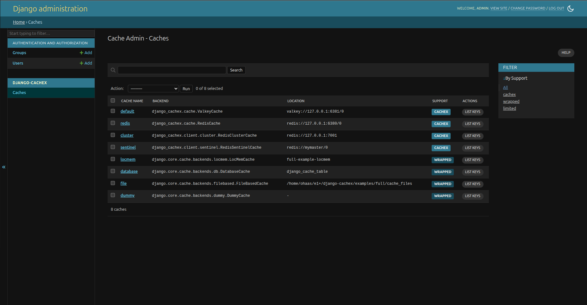
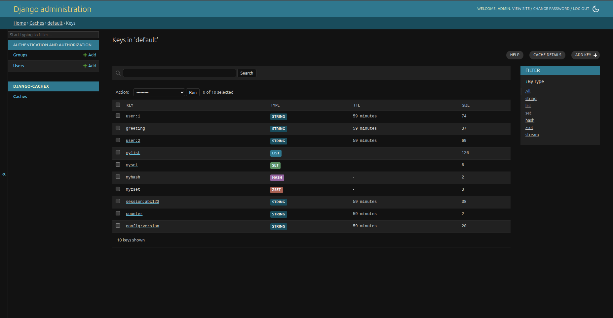
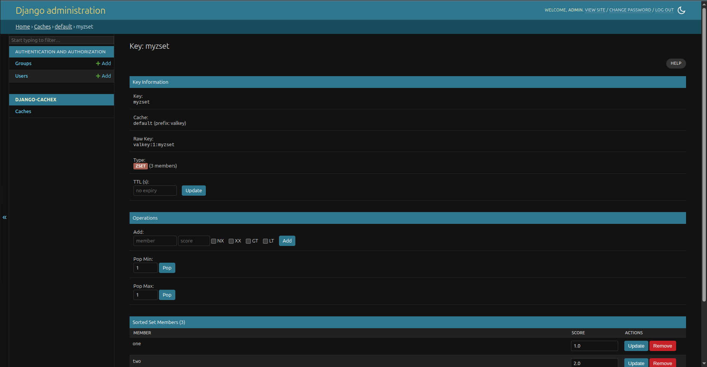

# django-cachex

[](https://pypi.org/project/django-cachex/)
[](https://pypi.org/project/django-cachex/)
[](https://github.com/oliverhaas/django-cachex/actions/workflows/ci.yml)

Valkey and Redis cache backend for Django, with a Django admin UI for cache inspection.

## Installation

```console
pip install django-cachex[valkey-py]
# or
pip install django-cachex[redis-py]
```

## Quick Start

```python
CACHES = {
    "default": {
        "BACKEND": "django_cachex.cache.ValkeyCache",  # or RedisCache
        "LOCATION": "valkey://127.0.0.1:6379/1",       # or redis://...
    }
}
```

## What's in the box

- One package for both Valkey and Redis, default and Sentinel and Cluster.
- Sync and async are first-class. The async cache also works from sync code.
- Hash, list, set, sorted set, and stream operations on the cache object.
- TTL and pattern helpers (`ttl()`, `expire()`, `keys()`, `delete_pattern()`).
- Distributed locks: `cache.lock()`.
- Lua scripting with automatic key prefixing and value encoding/decoding.
- Pluggable serializers (Pickle, JSON, MsgPack, ormsgpack, orjson) and compressors (Zlib, Gzip, LZ4, LZMA, Zstandard), each with fallback chains for safe migrations.
- Cache stampede prevention (TTL-based XFetch).
- Two composite backends: `StreamCache` (cross-pod stream-synchronized in-memory cache) and `TieredCache` (L1/L2 with TTL propagation).
- Django `LocMemCache` and `DatabaseCache` extensions with the same data-structure ops and admin support.
- Optional Rust I/O driver (PyO3 + tokio + redis-rs) under the same `RespCache` API. Free-threaded CPython (3.14t) supported.
- Django admin UI for browsing keys, inspecting values, editing, and flushing — see below.

## Cache Admin

Add `django_cachex.admin` to your `INSTALLED_APPS` to enable the cache admin interface:

```python
INSTALLED_APPS = [
    # ...
    "django_cachex.admin",
]
```

Browse all configured caches, search and filter keys by type, and manage values directly:





Features:
- Browse all configured cache backends (Valkey, Redis, LocMemCache, DatabaseCache, and more)
- Search keys with wildcard patterns (`user:*`, `*:session`)
- Filter by key type (string, list, set, hash, zset, stream)
- View and edit values with type-specific operations
- Inspect and modify TTL
- View server info and memory statistics
- Flush caches

## Documentation

Full documentation at [oliverhaas.github.io/django-cachex](https://oliverhaas.github.io/django-cachex/)

## Requirements

- Python 3.14+ (free-threaded supported)
- Django 6.0+
- valkey-py 6.1+ or redis-py 6.0+

The Rust I/O driver is optional. To opt in, install with the `redis-rs`
extra (`pip install django-cachex[redis-rs]`); this pulls in the
`django-cachex-redis-rs` companion package. Prebuilt wheels are published
for Linux x86_64, Linux aarch64, macOS arm64, and Windows amd64, on
both cp314 and cp314t (free-threaded). Without the extra, the
`RedisRsCache` backends are unavailable but
everything else works.

## Acknowledgments

This project started from [django-redis](https://github.com/jazzband/django-redis) and Django's official [Redis cache backend](https://docs.djangoproject.com/en/stable/topics/cache/#redis). Some serializer and compressor utility code is derived from django-redis, licensed under BSD-3-Clause. The admin UI was inspired by [django-redisboard](https://github.com/ionelmc/django-redisboard).

The Rust I/O driver and async bridge are heavily inspired by — and in places directly adapted from — [django-vcache](https://gitlab.com/glitchtip/django-vcache) (MIT, by David Burke / GlitchTip). The fork-safe tokio runtime, the `RedisRsAwaitable` deferred-loop-binding pattern, and the multiplexed-connection design all originate there.

I also want to mention [django-valkey](https://github.com/django-commons/django-valkey) and [dj-cache-panel](https://github.com/yassi/dj-cache-panel), which I never really used, but are newer and interesting efforts of similar goals as this package has.

## License

MIT
