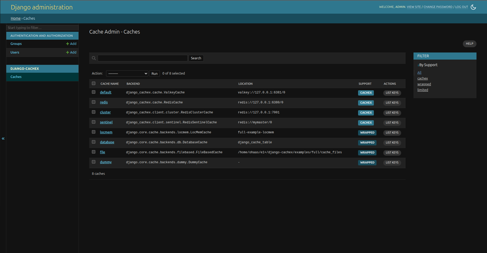
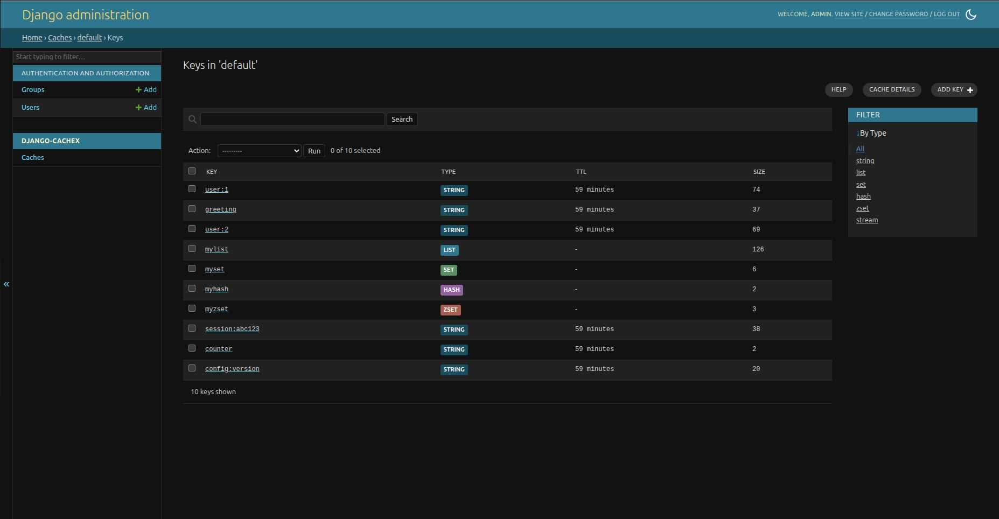
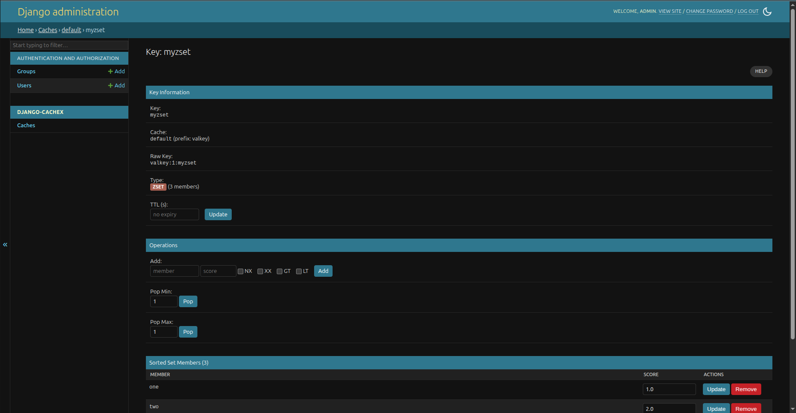

# Cache Admin

django-cachex provides a Django admin interface for browsing cache keys, viewing values, and adding, editing, or deleting entries.

## Installation

Add `django_cachex.admin` to your `INSTALLED_APPS`:

```python
INSTALLED_APPS = [
    # ... other apps
    "django.contrib.admin",
    "django_cachex.admin",  # Cache admin interface
]
```

The admin sidebar gets a "django-cachex" app heading with two entries, "Caches" and "Keys".

## Permissions

The admin uses Django's built-in permission system. Superusers have full access. Staff users need explicit permissions:

- `django_cachex.view_cache` / `view_key`: view caches and keys
- `django_cachex.change_cache`: cache-wide actions, meaning the cache list's Flush action and the key browser's Clear tool (both call `cache.clear()`, which removes the current version's keys), and the cache detail page's danger zone (clear all versions, flush the database)
- `django_cachex.add_key`: create keys, including the key browser's Add key tool
- `django_cachex.change_key`: every mutation on the key detail page, including editing values and setting or removing a TTL. Without it the page renders read-only.
- `django_cachex.delete_key`: delete keys

## Support Levels

Different cache backends have different levels of support:

| Badge | Level | Description |
|-------|-------|-------------|
| **cachex** | Full Support | django-cachex backends (`ValkeyCache`, `RedisCache`, `LocMemCache`, `DatabaseCache`, etc.). All features: key listing, pattern search, TTL inspection, and data type operations. The cluster backends carry this badge but do not list keys, see below. |
| **limited** | Limited Support | Stock Django backends (`django.core.cache.backends.*`), custom backends, and `TrackingCache`. The cache is listed and configurable, but key browsing isn't available. |

### Using Django's stock LocMemCache or DatabaseCache?

Switch to `django_cachex.cache.LocMemCache` / `django_cachex.cache.DatabaseCache` for full admin support. Both are drop-in replacements for the stock Django classes.

### Using Django's stock Redis backend?

Switch to `ValkeyCache` / `RedisCache` for full functionality. See the [migration guide](../migration.md) for migration instructions.

### Browsing a cluster alias

`RedisClusterCache`, `ValkeyClusterCache` and `ValkeyGlideClusterCache` are
badged **cachex**, but the key browser shows an empty list with the message
"Key browsing is not supported on cluster cache": cluster `SCAN` returns one
cursor per node, which the paginator cannot hand back as a single cursor. The
key detail page (by key name), Add key, Flush and the danger zone are not
affected.

### Browsing a `TrackingCache` alias

A `TrackingCache` alias is badged **limited**, so the admin lists it and its
configuration but offers no key browsing. Its keys live on the transport, and
the local store only mirrors them; browse and edit through the transport alias,
which is badged **cachex**.

## Views

### Caches (Index)

Lists all configured caches showing name, backend class, location, and support level.



Actions: Flush selected caches. Flush calls `cache.clear()`, which on the Valkey/Redis backends is a pattern delete over the alias's `KEY_PREFIX` and `VERSION`, not `FLUSHDB`; the danger zone on the cache detail page has the `FLUSHDB` equivalent.

Every `LOCATION` the admin renders has its URL password replaced with `***`,
here, in the cache detail page's Configuration section, and in connection URLs
quoted inside backend error messages, including every admin message that quotes
a driver exception. A `***` on the page is masking, not a misconfiguration: the
setting itself is untouched. `unix://` socket paths and non-URL locations such
as `host:port` are shown as they are.

A backend whose server cannot be reached is reported with a message
("Cache '<alias>' is unreachable: ...") and a redirect to this list from the key
detail and key add pages, rather than an error page.

### Key Browser

Click a cache name to browse its keys with wildcard search (`*`), data type display, TTL, and pagination. Each page issues up to five `SCAN` calls (`count`, default 100, capped at 1000, is the hint passed to each) and stops once it holds at least half of `count` keys or the cursor reaches 0; TTL, type and size are fetched in a pipeline per page rather than per key.



Actions: Delete selected keys, add new key.

### Key Detail

View and edit a specific key's value (formatted JSON for objects/arrays), data type, and TTL. Supports editing the value, setting the TTL, running the operations for the key's data type, and deleting the key.

A key whose server-side type the admin cannot render is shown read-only: the type is named, the value is not displayed, and no type-specific operations are offered. Delete and the TTL form still work.

A cache backend with no `type()` at all (`django.core.cache.backends.locmem.LocMemCache` and the other stock Django backends) gets the same treatment: the page renders, and any type-specific write is refused with "This cache backend does not report key types, so only deleting it is available." Delete stays available. The TTL form needs `expire()` and `persist()`, which the stock backends lack, so it is not shown there; on a typeless backend that does have both, the message reads "so only deleting the key and setting its TTL are available" instead.

Deleting a key that is already gone reports "Key not found, nothing was deleted." rather than success, and the key browser's bulk delete counts those misses separately.

A type-specific action (push onto a list, add a hash field, ...) posted against a key whose type has changed since the page loaded is refused with a message and nothing is written; the page reloads with the current value. The TTL form is shown, and Set TTL accepted, only on backends with `expire()` and `persist()`; the stock Django backends have neither, so there the page offers delete only.

Set members on the Valkey/Redis backends are listed in server (`SSCAN`) order, which is not stable across pages of a set that is being written to; `LocMemCache` and `DatabaseCache` list them sorted. Hash pages read only the fields on the current page.



### Cache Info

View server information: configuration, server version/uptime, memory usage, connected clients, command statistics, and keyspace data.

Sections a backend cannot answer are omitted rather than rendered empty or with an error box. The Slow Log, which only the Valkey/Redis backends implement, is hidden everywhere else, and a backend with no `info()` still gets its Configuration section from `settings.CACHES` while the server, memory and statistics sections are skipped.

### Add Key

Name the new key and pick its data type (string, list, set, hash, zset or stream; anything else is rejected). Nothing is written yet: **Continue** opens the key detail page, where the first value you add creates the key.

## Backend Abilities

The admin adapts based on backend capabilities:

| Feature | RESP backends (Valkey/Redis) | LocMemCache / DatabaseCache | limited |
|---------|------------------------------|-----------------------------|---------|
| List keys | Yes | Yes | No |
| Get key | Yes | Yes | No |
| Delete key | Yes | Yes | No |
| Edit key | Yes | Yes | No |
| Get TTL | Yes | Yes | No |
| Get type | Yes | Yes (no stream type) | No |
| Cache info | Yes | Yes | No |
| Flush cache (`clear()`) | Yes | Yes | Yes |
| Danger zone (clear all versions, FLUSHDB) | Yes | No | No |
| Conflict detection on edit | Yes | No | No |

## Tips

- Use `*` as a wildcard in the key search, so `user:*` finds every key starting with `user:`.
- Enter valid JSON when editing to store objects or arrays.
- Each view has a help button with tips for that view.
- On RESP backends an edit is rejected if the value changed since the page loaded. Other backends save without that check.
