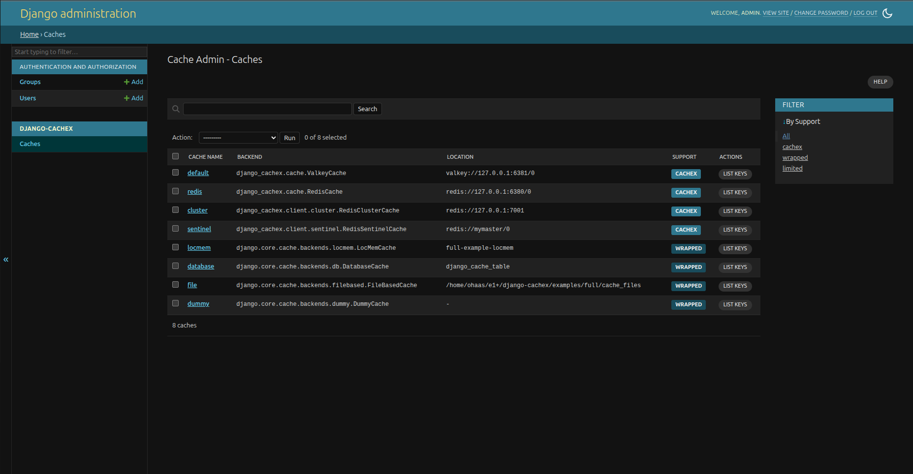
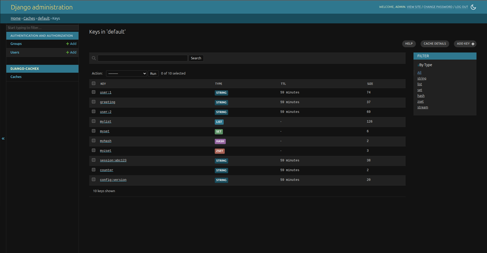
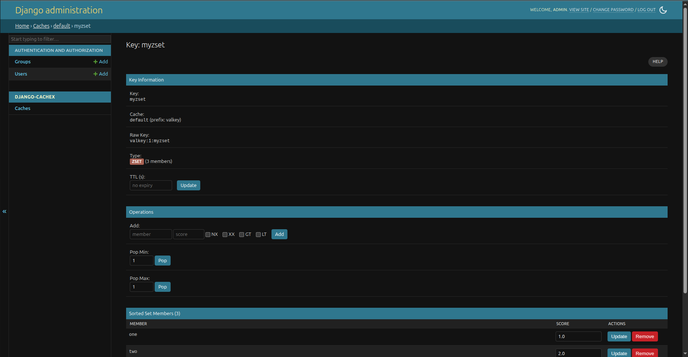

# Cache Admin

The cache admin browses cache keys, shows their values, and adds, edits and deletes entries.

## Installation

Add `django_cachex.admin` to `INSTALLED_APPS`:

```python
INSTALLED_APPS = [
    # ... other apps
    "django.contrib.admin",
    "django_cachex.admin",  # Cache admin interface
]
```

The admin sidebar gets a "django-cachex" app heading with two entries, "Caches" and "Keys".

## Permissions

Superusers have full access. Staff users need these Django permissions:

- `django_cachex.view_cache` / `view_key`: view caches and keys.
- `django_cachex.change_cache`: the cache list's Flush action, the key browser's Clear tool, and the cache detail page's danger zone (clear all versions, flush the database). Flush and Clear call `cache.clear()`, which removes the current version's keys.
- `django_cachex.add_key`: create keys, including with the key browser's Add key tool.
- `django_cachex.change_key`: every mutation on the key detail page, including editing values and setting or removing a TTL. Without it, the page is read-only.
- `django_cachex.delete_key`: delete keys.

## Support Levels

The cache list badges each cache with its support level:

| Badge | Level | Description |
|-------|-------|-------------|
| cachex | Full Support | django-cachex backends: the Valkey and Redis backends, `LocMemCache` and `DatabaseCache`. All features: key listing, pattern search, TTL inspection and data type operations. The cluster backends have this badge but do not list keys (see [Browsing a cluster alias](#browsing-a-cluster-alias)). |
| limited | Limited Support | Stock Django backends (`django.core.cache.backends.*`), custom backends and `TrackingCache`. The admin lists the cache and shows its configuration, but offers no key browsing. |

### Django's stock LocMemCache and DatabaseCache

Switch to `django_cachex.cache.LocMemCache` or `django_cachex.cache.DatabaseCache` for full admin support. Both are drop-in replacements for the stock Django classes.

### Django's stock Redis backend

Switch to `ValkeyCache` or `RedisCache` for full functionality. The [migration guide](../migration.md) has the steps.

### Browsing a cluster alias

`RedisClusterCache`, `ValkeyClusterCache` and `ValkeyGlideClusterCache` have
the "cachex" badge. Their key browser shows an empty list with the message
"Key browsing is not supported on cluster cache". Cluster `SCAN` returns one
cursor per node, and the paginator needs a single cursor. The key detail page
(opened by key name), Add key, Flush and the danger zone work as usual.

### Browsing a `TrackingCache` alias

A `TrackingCache` alias has the "limited" badge. Its keys live on the
transport alias, which has the "cachex" badge. Browse and edit them there.

## Views

### Caches (Index)

The cache list shows every configured cache with its name, backend class, location and support level.



The Flush action calls `cache.clear()` on the selected caches. On the Valkey and Redis backends, `clear()` deletes only the keys that match the alias's `KEY_PREFIX` and `VERSION`. To run `FLUSHDB`, use the danger zone on the cache detail page.

The admin replaces the password in every connection URL it shows with `***`.
This covers the cache list, the Configuration section of the cache detail page,
and every admin message that quotes a connection URL or a driver exception.
The setting itself does not change. `unix://` socket paths and non-URL
locations such as `host:port` are shown unchanged.

When a server cannot be reached, the key detail and key add pages redirect to
the cache list with the message "Cache '<alias>' is unreachable: ...".

### Key Browser

Click a cache name to browse its keys, with wildcard search (`*`), each key's type and TTL, and pagination. Each page runs up to five `SCAN` calls, with the `count` URL parameter as the hint (default 100, at most 1000). It stops after it has at least half of `count` keys or the cursor reaches 0. On the Valkey and Redis backends, the TTL, type and size of the keys on a page are fetched in a few pipelined round trips.



Select keys to delete them in bulk, or use the Add key tool to create one.

### Key Detail

The key detail page shows a key's value (objects and arrays as formatted JSON), data type and TTL. It edits the value and the TTL, runs the operations for the key's type, and deletes the key.

A key of a type the admin cannot render is read-only. The page names the type, hides the value and offers no type-specific operations. Delete and the TTL form still work.

The stock Django backends, such as `django.core.cache.backends.locmem.LocMemCache`, have no `type()`. Their key pages render, but refuse every type-specific write with "This cache backend does not report key types, so only deleting it is available."

The TTL form is shown, and Set TTL accepted, only on backends with `expire()` and `persist()`, which the stock Django backends lack. On a typeless backend that has both, the refusal reads "so only deleting the key and setting its TTL are available" instead.

Deleting a key that is already gone reports "Key not found, nothing was deleted." The key browser's bulk delete counts those misses separately.

A type-specific action, such as a list push or a new hash field, is refused when the key's type changed after the page loaded. Nothing is written, and the page reloads with the current value.

On the Valkey and Redis backends, set members come in server (`SSCAN`) order, which can change between pages while the set is written to. `LocMemCache` and `DatabaseCache` sort them. Hash pages read only the fields on the current page.



### Cache Info

The cache info page shows the configuration, server version and uptime, memory usage, connected clients, command statistics and keyspace data.

It omits the sections a backend cannot answer. Only the Valkey and Redis backends show the Slow Log. A backend without `info()` still shows its Configuration section, read from `settings.CACHES`, and skips the server, memory and statistics sections.

### Add Key

Name the new key and pick its data type: string, list, set, hash, zset or stream. Other types are rejected. **Continue** writes nothing and opens the key detail page, where the first value you add creates the key.

## Backend Abilities

| Feature | RESP backends (Valkey/Redis) | LocMemCache / DatabaseCache | limited |
|---------|------------------------------|-----------------------------|---------|
| List keys | Yes | Yes | No |
| Get key | Yes | Yes | No |
| Delete key | Yes | Yes | No |
| Edit key | Yes | Yes | No |
| Get TTL | Yes | Yes | No |
| Get type | Yes | Yes (no stream type) | No |
| Cache info | Yes | Yes | No |
| Flush cache (`clear()`) | Yes | Yes | Yes |
| Danger zone (clear all versions, FLUSHDB) | Yes | No | No |
| Conflict detection on edit | Yes | No | No |

## Tips

- Use `*` as a wildcard in the key search. `user:*` finds every key that starts with `user:`.
- Enter valid JSON when editing to store objects or arrays.
- Each view has a help button with tips for that view.
- On the Valkey and Redis backends, an edit is rejected if the value changed after the page loaded. Other backends save without that check.
